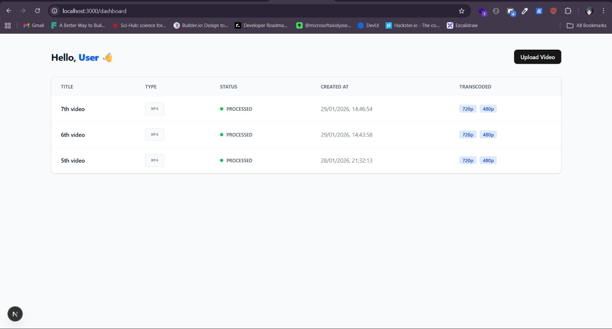

# Video Transcoding Platform

A full-stack video transcoding system featuring a modern web interface, asynchronous job processing, and real-time status tracking.

---

##  Features

- **Secure Authentication**: JWT-based login and registration with role-based access control.
- **Efficient Uploads**: Video uploads with automated metadata registration.
- **Asynchronous Transcoding**: Decoupled worker process using FFmpeg to convert videos into multiple resolutions (720p, 480p).
- **Real-time Dashboard**: Live status tracking and auto-polling to monitor transcoding progress without manual refreshes.

---

## Preview



---

## Architecture


1.  **Frontend (Next.js)**: Sends the video to the API and polls for status updates.
2.  **API Server (Express)**: Stores metadata in **MongoDB**, saves the source file, and publishes a job to **RabbitMQ**.
3.  **Worker Service (FFmpeg)**: Consumes the job from the queue, transcodes the video, and updates the database with the results.

---


### Prerequisites

- [Node.js](https://nodejs.org/) (v18+)
- [MongoDB](https://www.mongodb.com/)
- [RabbitMQ](https://www.rabbitmq.com/)
- [FFmpeg](https://ffmpeg.org/download.html) 


## Project Structure

```
.
├── backend/                # API Server & Database Logic
│   ├── src/
│   │   ├── modules/        # User, Video, and Job modules
│   │   ├── config/         # Server configurations
│   │   └── queue/          # RabbitMQ integration
│   ├── worker/             # Standalone Transcoding Worker
│   └── uploads/            # Local temporary storage for videos
└── frontend/               # Next.js Web Interface
    └── frontend/           # shadcn-ready frontend project
```

---

## 🛠️ Tech Stack

- **Frontend**: Next.js 15, Tailwind CSS, Shadcn UI, Radix UI.
- **Backend**: Node.js, Express, Mongoose.
- **Processing**: FFmpeg, RabbitMQ (amqplib).
- **DevOps**: TypeScript, Nodemon, Git.

---

